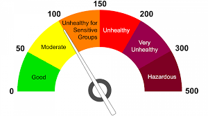

# Data Science Engineer

## Machine Learning/AI/Analytics/Deep Learning

### AQI Prediction

AQI: Machine learning methods, including adaptive
boosting (AdaBoost), artificial neural network (ANN), random forest, stacking ensemble, and support
vector machine (SVM), produce promising results for air quality index (AQI) level predictions. A series
of experiments, using datasets for three different regions to obtain the best prediction performance
from the stacking ensemble, AdaBoost, and random forest, found the stacking ensemble delivers
consistently superior performance 

